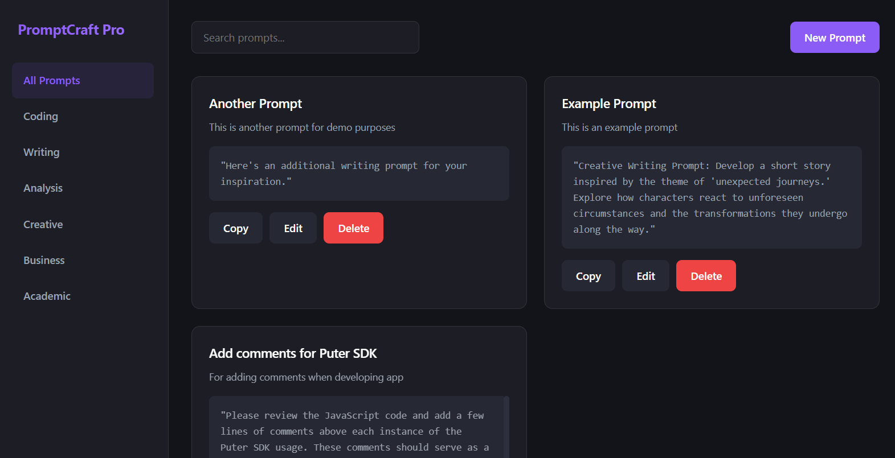

<h1 align="center">
  <a href="https://puter.com/app/prompt-management" target="_blank">Prompt Manager</a>
</h1>

  

A modern web application for creating, storing, and improving AI prompts with AI assistance.

## Features

- **Prompt Management**: Create, edit, and delete AI prompts
- **Category Organization**: Organize prompts by categories (Coding, Writing, Analysis, etc.)
- **AI-Powered Improvement**: Enhance your prompts with AI suggestions
- **Persistent Storage**: Save prompts to your [Puter Account](https://puter.com)
- **Modern UI**: Dark-themed, responsive interface

## How It Works

1. Create a new prompt with title, description, and content
2. Optionally use AI to improve your prompt
3. Save and organize prompts by category
4. Search and filter your prompt collection
5. Copy prompts to clipboard for use in AI applications

## Technical Details

This application uses:
- Puter.js SDK for authentication, storage, and AI capabilities
- Vanilla JavaScript for the frontend
- Modern CSS with custom variables for theming
- Responsive design for all device sizes

## Getting Started

Access the `index.html` file via a local server or an [online host](https://puter.com)

## License

MIT
